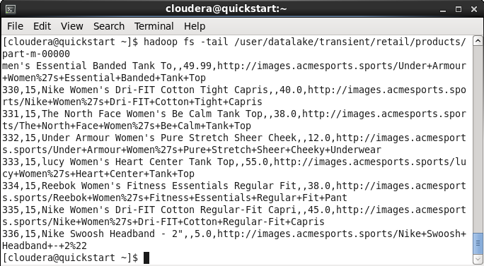
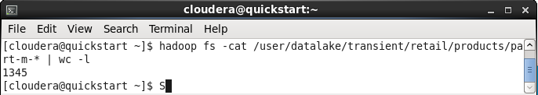
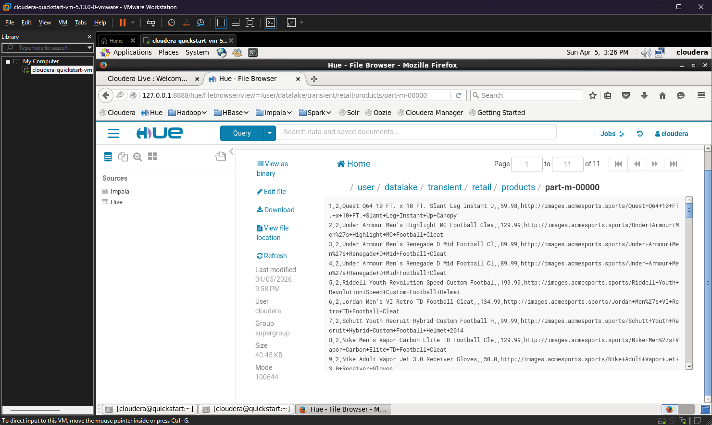

### Módulo: BIG DATA ARCHITECTURE

# 🐘 Projeto de Ingestão de Dados: MySQL para Hadoop (HDFS)

## 🎯 Resumo
Este repositório contém o primeiro exercício prático do curso de **Data Science da FIAP**, focado em engenharia de dados. O objetivo principal foi realizar a ingestão de dados de um banco relacional (MySQL) para um ambiente de Big Data (Hadoop) utilizando a ferramenta **Apache Sqoop**.

## 🖥️ Ambiente de Infraestrutura
Para garantir a simulação fiel de um cluster de produção, o projeto foi desenvolvido em um ambiente virtualizado:
* **Hypervisor:** VMware Workstation.
* **Sistema Operacional:** Cloudera QuickStart VM (CentOS 6.7).
* **Serviços Ativos:** HDFS, MapReduce, MySQL e Hue.

## 🏗️ Arquitetura do Data Lake
A ingestão foi estruturada seguindo as melhores práticas de governança, utilizando a camada **Transient** como zona de pouso (Landing Zone) para os dados brutos, garantindo a imutabilidade da origem.

* **Diretório de Destino:** `/user/datalake/transient/retail/products`
* **Formato de Saída:** Arquivos de texto delimitados (CSV).

## 🛠️ Passo a Passo da Execução

### 1. Exploração e Conectividade
Antes da carga, validamos a estrutura da tabela `products` no MySQL e testamos a conectividade do Sqoop com o banco de dados.
> *Comandos detalhados disponíveis em: `CodigoUtilizados.sh`*

### 2. Ingestão com Idempotência
A importação foi realizada via Sqoop. Um ponto chave foi a utilização do parâmetro `--delete-target-dir`, que permite que o pipeline seja reexecutado sem erros de diretório já existente, tornando o processo resiliente.

### 3. Validação dos Dados
Após a carga, utilizamos o terminal e a interface gráfica **Hue** para confirmar a integridade:
* **Total de Registros:** 1345 linhas (validado via `wc -l`).
* **Estrutura:** Verificação dos arquivos `part-m-XXXXX` no HDFS.

## 📸 Evidências
Abaixo, as capturas de tela que comprovam o sucesso da operação:

### Validação de Conteúdo (Tail)

### Prova de Integridade (Contagem de Linhas)

### Visualização no Hue (Interface Gráfica)

Para outras imagens do processo completo acesse `img`*

## 👨‍💻 Aluno
**Pedro Henrique Sotero Bastos** *Estudante de Data Science na FIAP | Focado em Cloud Computing e Engenharia de Dados. Agradecimentos a Professora Tassiana Rugoni*
